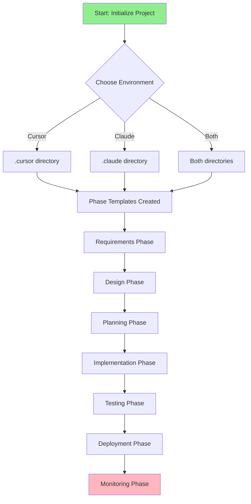
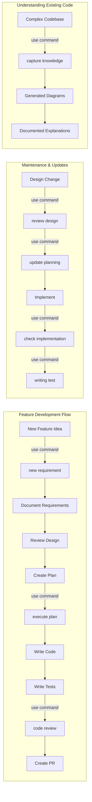
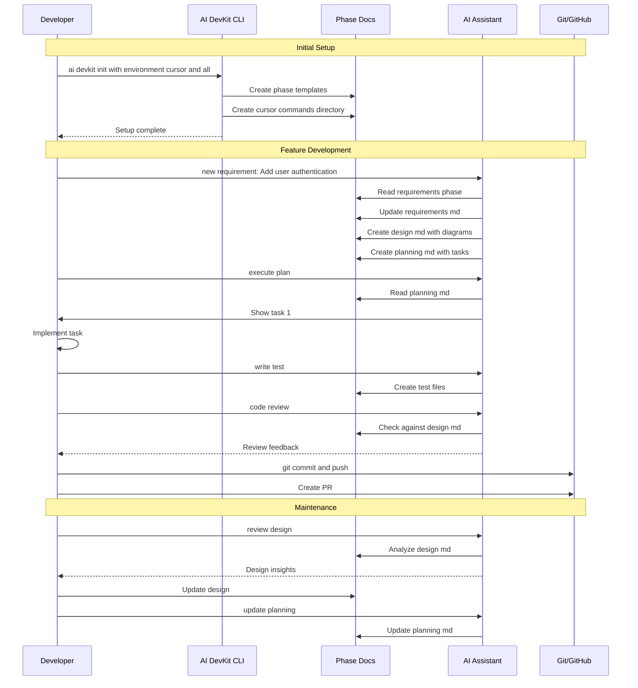
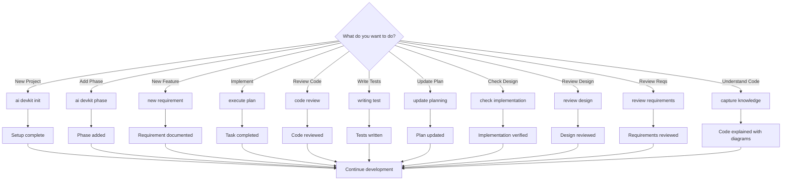
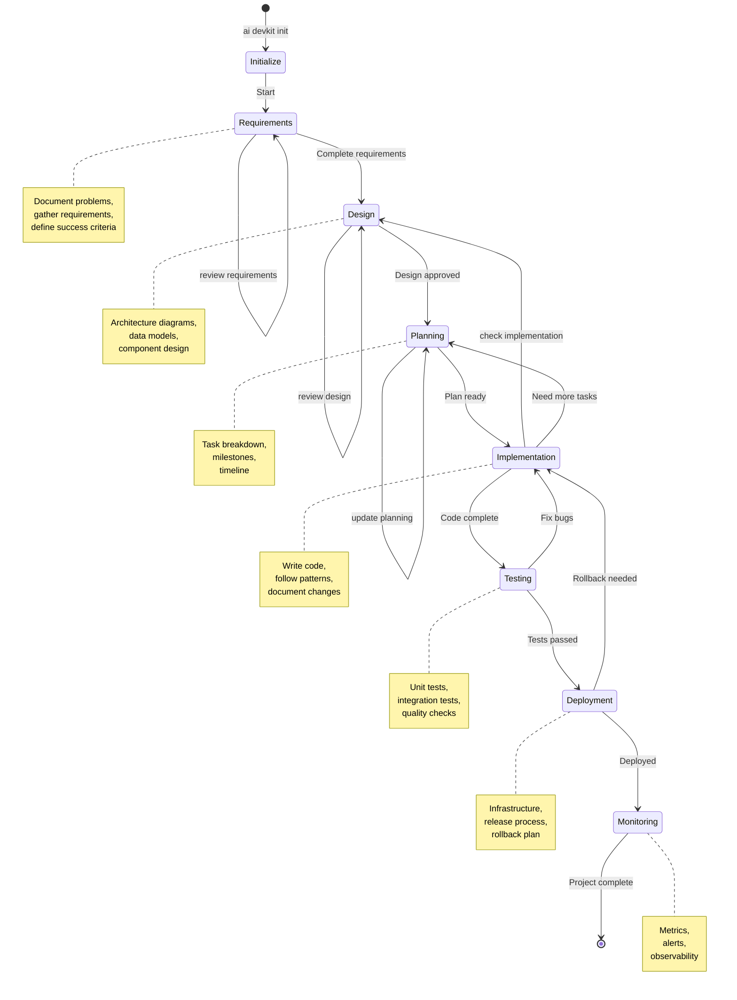
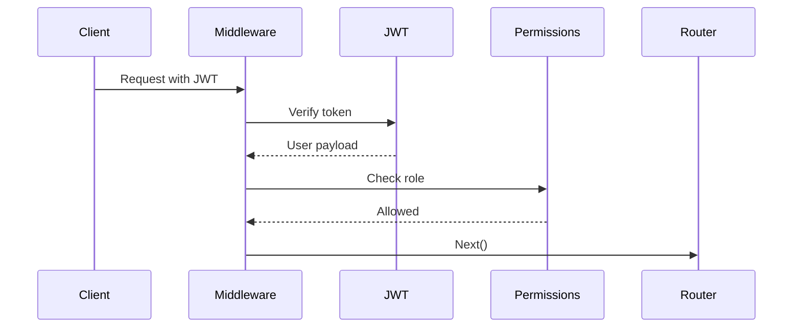

# AI DevKit

A CLI toolkit for AI-assisted software development with structured phase templates and environment setup for Cursor and Claude Code.

[](https://www.npmjs.com/package/ai-devkit)
[](https://opensource.org/licenses/MIT)

## Features

- 🎯 **Phase-based Development**: Structured templates for each stage of the software development lifecycle
- 🤖 **AI Environment Setup**: Automatic configuration for Cursor and Claude Code
- 📝 **Customizable Templates**: Markdown-based templates with YAML frontmatter
- 🚀 **Interactive CLI**: User-friendly prompts with flag override support
- ⚙️ **State Management**: Tracks initialized phases and configuration

## Installation

```bash
# Using npx (no installation needed)
npx ai-devkit init

# Or install globally
npm install -g ai-devkit
```

## Quick Start

Initialize AI DevKit in your project:

```bash
# Interactive mode (recommended)
ai-devkit init

# With flags
ai-devkit init --environment cursor --all

# Initialize specific phases
ai-devkit init --phases requirements,design,planning
```

This will:
1. Create a `.ai-devkit.json` configuration file
2. Set up your AI development environment (Cursor/Claude Code)
3. Generate phase templates in `docs/ai/`

Detailed user guide can be found [here](https://ai-devkit.com/docs/).

## Visual Workflow

### Complete Development Lifecycle



### Day-to-Day Development Workflows



### Command Usage Flow



### Command Quick Decision Tree



### Phase Transition Workflow



## Available Phases

- **Requirements**: Problem understanding, requirements gathering, and success criteria
- **Design**: System architecture, data models, and technical design (include mermaid diagrams for architecture/data flow)
- **Planning**: Task breakdown, milestones, and project timeline
- **Implementation**: Technical implementation notes and code guidelines
- **Testing**: Testing strategy, test cases, and quality assurance
- **Deployment**: Deployment process, infrastructure, and release procedures
- **Monitoring**: Monitoring strategy, metrics, alerts, and observability

## Commands

### `ai-devkit init`

Initialize AI DevKit in your project.

**Options:**
- `-e, --environment <env>`: Specify environment (cursor|claude|both)
- `-a, --all`: Initialize all phases at once
- `-p, --phases <phases>`: Comma-separated list of specific phases

**Examples:**
```bash
# Interactive mode
ai-devkit init

# Initialize for Cursor with all phases
ai-devkit init --environment cursor --all

# Initialize specific phases
ai-devkit init --phases requirements,design,implementation
```

### `ai-devkit phase [name]`

Add or update a specific phase template.

**Examples:**
```bash
# Interactive selection
ai-devkit phase

# Add specific phase
ai-devkit phase requirements
ai-devkit phase testing
```

## Generated Structure

After initialization, your project will have:

```
your-project/
├── .ai-devkit.json           # Configuration and state
├── docs/
│   └── ai/
│       ├── requirements/
│       │   └── README.md
│       ├── design/
│       │   └── README.md
│       ├── planning/
│       │   └── README.md
│       ├── implementation/
│       │   └── README.md
│       ├── testing/
│       │   └── README.md
│       ├── deployment/
│       │   └── README.md
│       └── monitoring/
│           └── README.md
└── [Environment-specific files]
```

### For Cursor:
```
└── .cursor/
    ├── rules/                # Project-specific rules (Markdown files)
    │   └── ai-devkit.md
    └── commands/             # Custom slash commands (Markdown files)
        ├── new-requirement.md
        ├── code-review.md
        ├── execute-plan.md
        ├── writing-test.md
        ├── update-planning.md
        ├── check-implementation.md
        ├── review-design.md
        ├── review-requirements.md
        └── capture-knowledge.md
```

### For Claude Code:
```
└── .claude/
    ├── CLAUDE.md             # Workspace configuration
    └── commands/             # Custom commands (Markdown files)
        ├── new-requirement.md
        ├── code-review.md
        ├── execute-plan.md
        ├── writing-test.md
        ├── update-planning.md
        ├── check-implementation.md
        ├── review-design.md
        ├── review-requirements.md
        └── capture-knowledge.md
```

## Customizing Templates

All templates are plain Markdown files with YAML frontmatter. You can customize them to fit your project's needs:

```markdown
---
phase: requirements
title: Requirements & Problem Understanding
description: Clarify the problem space, gather requirements, and define success criteria
---

# Your custom content here
```

Templates are designed to provide structure while remaining concise and AI-friendly.

## Environment Setup

### Cursor

Generated files:
- `.cursor/rules/`: Project-specific rules as Markdown files (per [Cursor documentation](https://cursor.com/docs/context/rules))
- `.cursor/commands/`: Custom slash commands as Markdown files (per [Cursor documentation](https://cursor.com/docs/agent/chat/commands))

Available slash commands:
- `/new-requirement`: Complete workflow for adding a new feature from requirements to PR
- `/code-review`: Structured local code review against design docs before pushing changes
- `/execute-plan`: Walk a feature plan task-by-task with interactive prompts
- `/writing-test`: Write unit/integration tests targeting 100% coverage
- `/update-planning`: Update planning and task breakdown
- `/check-implementation`: Compare implementation with design
- `/review-design`: Review system design and architecture
- `/review-requirements`: Review and summarize requirements
- `/capture-knowledge`: Analyze and document complex code with dependency analysis and diagrams

Each command is stored as a plain Markdown file in `.cursor/commands/` and will automatically appear when you type `/` in Cursor's chat input.

### Claude Code

Generated files:
- `.claude/CLAUDE.md`: Workspace configuration and guidelines
- `.claude/commands/`: Custom commands as Markdown files

Available commands:
- `new-requirement` - Complete workflow for adding a new feature from requirements to PR
- `code-review` - Structured local code review against design docs before pushing changes
- `execute-plan` - Walk a feature plan task-by-task with interactive prompts
- `writing-test` - Write unit/integration tests targeting 100% coverage
- `update-planning` - Update planning and task breakdown
- `check-implementation` - Compare implementation with design
- `review-design` - Review system design and architecture
- `review-requirements` - Review and summarize requirements
- `capture-knowledge` - Analyze and explain code with recursive dependency analysis and Mermaid diagrams

Commands can be referenced in Claude Code chats to guide AI assistance through your development phases.

## Workflow Examples

### Initial Project Setup

1. **Initialize your project:**
   ```bash
   ai-devkit init
   ```

2. **Start with requirements:**
   - Fill out `docs/ai/requirements/README.md`
   - Use your AI assistant to help clarify and document requirements

3. **Design your system:**
   - Complete `docs/ai/design/README.md` and feature-specific files
   - Include mermaid diagrams for architecture, component interactions, and data flow
   - Reference requirements when making design decisions

4. **Plan your work:**
   - Break down tasks in `docs/ai/planning/README.md`
   - Estimate and prioritize

5. **Implement with guidance:**
   - Follow patterns in `docs/ai/implementation/README.md`
   - Keep implementation notes updated

6. **Test thoroughly:**
   - Use `docs/ai/testing/README.md` as your testing guide
   - Document test cases and results

7. **Deploy confidently:**
   - Follow deployment procedures in `docs/ai/deployment/README.md`

8. **Monitor and iterate:**
   - Set up monitoring per `docs/ai/monitoring/README.md`

### Understanding Existing Code with Capture Knowledge

The `capture-knowledge` command helps you analyze and document complex code by creating structured documentation with diagrams. This is especially useful when:
- Working with legacy code or unfamiliar codebases
- Onboarding new team members
- Planning refactoring or improvements
- Documenting complex business logic

#### Step-by-Step Guide

**Step 1: Start the command**

```bash
# In Cursor: Type /capture-knowledge in the AI chat
# In Claude Code: Mention "capture-knowledge" in your chat
```

**Step 2: Provide entry point**

Tell the AI what you want to understand. Examples:

```
I want to understand the authentication system. Start with src/auth/index.ts
```

```
Help me understand the payment processing flow in the checkout module
```

```
I need to understand how user data is validated in the api/users directory
```

**Step 3: AI analyzes the code**

The AI will:
1. Read the entry point file
2. Build a dependency tree (up to depth 3)
3. Track relationships between modules
4. Extract core logic and patterns
5. Identify important external dependencies

**Step 4: Review generated documentation**

The AI creates a file in `docs/ai/implementation/knowledge-*.md` containing:
- Overview of the code's purpose
- Implementation details with key logic
- Dependency diagram (Mermaid)
- Data flow or execution flow diagrams
- Error handling and edge cases
- Potential improvements or concerns
- Metadata (analysis date, files analyzed)

**Step 5: Refine if needed**

Ask for deeper analysis of specific areas:

```
Go deeper into the database query layer
```

```
Show me the error handling patterns
```

```
Focus more on the security aspects
```

#### Real Example

Let's say you want to understand a user authentication system:

**Input:**
```
/capture-knowledge

Entry point: src/auth/middleware.ts
Goal: Understand how authentication and authorization work in this API
```

**AI Process:**
1. Reads `src/auth/middleware.ts`
2. Follows imports to `src/auth/jwt.ts`, `src/auth/permissions.ts`
3. Traces dependencies to `src/db/models/User.ts`
4. Analyzes external packages used
5. Creates diagrams showing the authentication flow

**Output:** `docs/ai/implementation/knowledge-auth-middleware.md`

```markdown
# Authentication Middleware Analysis

## Overview
The authentication middleware validates JWT tokens and enforces role-based access control...

## Dependencies
- Internal: jwt.ts, permissions.ts, User model
- External: jsonwebtoken, express

## Flow Diagram


## Core Logic
1. Extract token from Authorization header
2. Verify signature and expiry
3. Check user permissions
4. Attach user context to request
...

## Findings
- Uses HS256 algorithm with secret key
- Refresh token not implemented
- Permission checks could be cached
```

#### Best Practices

1. **Start broad, then go deep**
   - First capture the overall architecture
   - Then use `/capture-knowledge` again for specific modules

2. **Provide context**
   - Mention why you're analyzing this code
   - Specify what aspects are most important

3. **Use the output**
   - Review diagrams to understand relationships
   - Share with team members for onboarding
   - Reference during code reviews

4. **Keep it updated**
   - Re-run when significant changes are made
   - Update manually if refactoring occurs

5. **Iterate**
   - First capture might be high-level
   - Ask follow-up questions for details

#### Common Use Cases

**Onboarding to a codebase:**
```
/capture-knowledge src/api/routes/users.ts
Goal: Help me understand the user management API endpoints
```

**Debugging a bug:**
```
/capture-knowledge src/services/payment.ts
Goal: I need to understand the payment processing flow to fix issue #123
```

**Planning refactoring:**
```
/capture-knowledge src/utils/dataProcessor.ts
Goal: Analyze this file before refactoring to understand dependencies
```

**Documenting architecture:**
```
/capture-knowledge src/
Goal: Create overview documentation of the main architecture patterns
```

## Use Cases

- **New Projects**: Scaffold complete development documentation
- **Existing Projects**: Add structured documentation gradually
- **Team Collaboration**: Share common development practices
- **AI Pair Programming**: Provide context for AI assistants
- **Knowledge Management**: Document decisions and patterns

## Best Practices

1. **Keep templates updated**: As your project evolves, update phase documentation
2. **Reference across phases**: Link requirements to design, design to implementation
3. **Use with AI assistants**: Templates are designed to work well with AI code assistants
4. **Customize for your needs**: Templates are starting points, not rigid requirements
5. **Track decisions**: Document architectural decisions and their rationale

## Configuration File

The `.ai-devkit.json` file tracks your setup:

```json
{
  "version": "0.2.0",
  "environment": "cursor",
  "initializedPhases": ["requirements", "design", "planning"],
  "createdAt": "2025-10-14T...",
  "updatedAt": "2025-10-14T..."
}
```

## Development

To work on ai-devkit itself:

```bash
# Clone the repository
git clone <repository-url>
cd ai-devkit

# Install dependencies
npm install

# Run in development mode
npm run dev init

# Build
npm run build

# Test locally
npm link
ai-devkit init
```

> **Note:** `ai-devkit init` now ensures the current directory is a git repository. If git is available and the repo isn't initialized, it will run `git init` automatically.

## Contributing

Contributions are welcome! Please feel free to submit issues and pull requests.

## License

MIT

---

**Happy building with AI! 🚀**

## Quick Reference

| Task | Command |
|------|---------|
| Initialize everything | `npx ai-devkit init --all` |
| Initialize for Cursor | `npx ai-devkit init --environment cursor` |
| Add specific phases | `npx ai-devkit init --phases requirements,design` |
| Add one phase later | `npx ai-devkit phase testing` |
| Guided feature workflow | `/new-requirement` (Cursor & Claude) |
| Execute feature plan | `/execute-plan` (Cursor & Claude) |
| Generate tests | `/writing-test` (Cursor & Claude) |
| Local code review | `/code-review` (Cursor & Claude) |
| Help | `npx ai-devkit --help` |

| Quick links | Description |
|-------------|-------------|
| [CHANGELOG.md](CHANGELOG.md) | Recent changes and release notes |
| [templates/](templates/) | Phase and environment templates |

